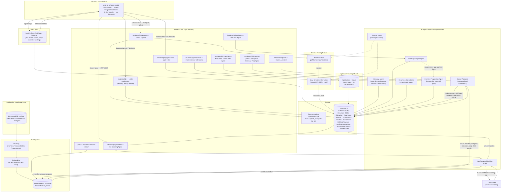
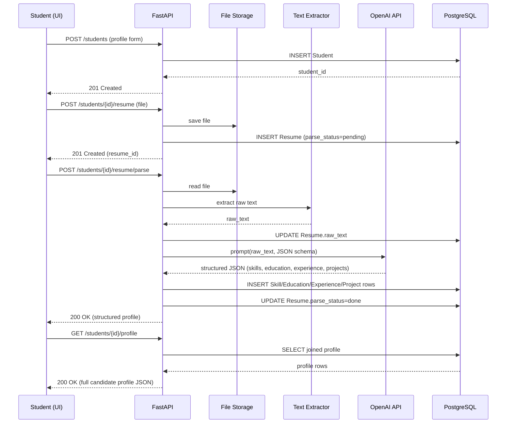
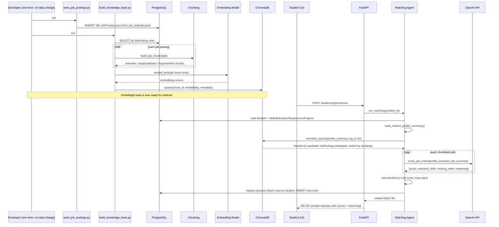

# System Architecture — AI Career Companion Agent

## 1. High-Level Architecture Diagram

> **Milestone 1** built the solid Profile/Resume path: UI → API → Storage →
> Resume Parsing Module → Candidate Profile in PostgreSQL.
> **Milestone 2** adds the Job-Posting Knowledge Base, the RAG Pipeline
> (chunk → embed → ChromaDB), and the Job-Resume Matching Agent.
> **App layer** wraps these in a real per-user product: JWT-based
> auth (register/login), every endpoint scoped to "self only" via the
> logged-in token, and a basic Application Tracking Module (apply + list).
> **AI Chat Bot / Mock Interview** adds the general Interview Agent: a
> curated, domain-organized question bank (563 questions across the same
> 19 domains as the job-postings KB — see `docs/interview_question_bank.md`)
> that a student draws a personalized 25-question set from, answers by voice
> or typed text, and submits for LLM-generated feedback — saved in its own
> history tab.
> **Milestone 3** (this update) adds four more agents, all grounded in one
> specific selected internship posting and the student's real profile: the
> *Skill Gap Analysis Agent* (categorized gaps + recommendations), the
> *Resume & Cover Letter Customization Agent* (tailored materials the
> student can edit and download, with an explicit no-fabrication
> constraint), the **job-specific Interview Preparation Agent* (twenty-five
> question categories with per-question guidance + revision topics — reuses
> a saved Skill Gap analysis for that job when one exists, distinct from the
> general Mock Interview bot above), and the **Conversational Career
> Assistant** (a persistent chat that reads the student's profile, top
> matches, and — when a specific job is selected — that job's saved skill
> gap/materials/prep, plus a RAG lookup over the knowledge base when no job
> is selected, so its answers are grounded rather than generic). All four
> are implemented — see the README's "Try the full flow" section for where
> each one lives in the UI.
> Every agent (Milestone 2 onward) follows the same two-stage pattern:
> retrieve/assemble real context cheaply (DB rows, RAG search), then make
> one focused, JSON-constrained LLM call that reasons over that context —
> never inventing facts not present in it.
>**Milestone 4** (this update) *Application tracking model* manage applied roles,
> status update,and deadline remainders. *Conducted End ti End testing* and optimized embedding quality
> qality, prompt report, and final demonstration. **ALL Milestones are completed by sk**

## 2. Agent Responsibilities

| Agent | Status | Responsibility | Primary Inputs | Primary Outputs |
|---|---|---|---|---|
| **Resume Agent** | ✅ Implemented (M1) | Owns resume understanding: parsing, structured extraction. | Uploaded resume file | Structured candidate profile |
| **Job-Resume Matching Agent** | ✅ Implemented (M2) | Retrieves relevant job postings for a candidate via RAG and scores fit with reasoning. | Candidate profile, job KB | Ranked matches with rationale |
| **Interview Agent** | ✅ Implemented | General mock interview: 25-question set (technical + behavioral) from the candidate's matched domain, voice/typed answers, AI feedback + score. | Candidate profile, curated question bank | Q&A transcript, score, feedback |
| **Skill Gap Analysis Agent** | ✅ Implemented (M3.1) | Compares candidate profile against one specific job posting; classifies gaps (critical/partial/preferred/experience/qualification) with reasons and recommendations. | Candidate profile, one job posting | Categorized gap report + recommendations |
| **Resume & Cover Letter Customization Agent** | ✅ Implemented (M3.2) | Generates a tailored resume and cover letter for one specific job, reordering/rewording only what's true — never inventing skills or experience. Student can edit and download both. | Candidate profile, one job posting | Editable tailored resume + cover letter |
| **Interview Preparation Agent** | ✅ Implemented (M3.3) | Job-specific prep: 5 question categories (technical, resume-based, project-based, role-specific, HR) with per-question guidance, plus revision topics — reuses a saved Skill Gap analysis for that job when available. | Candidate profile, one job posting, saved skill gap (if any) | Categorized questions + guidance, revision topics |
| **Career Assistant** | ✅ Implemented (M3.4) | Persistent conversational assistant. Reads profile, top matches, and (per-job) saved gap/materials/prep, plus a RAG lookup when no job is selected. Answers questions, explains fit/gaps, helps with decisions. | Free-form student messages, all other agents' saved outputs, RAG KB | Conversational replies, grounded and personalized |

The Matching Agent's implementation (`backend/app/services/matching_agent.py`)
is a two-stage pipeline, which is the concrete instance of the
Orchestrator/Pipeline pattern discussed in `research_notes.md` M1.3:

1. **Retrieval stage (cheap, no LLM):** the candidate profile is turned into
   a plain-text summary and used as a RAG query against the job-posting
   vector store, returning a shortlist (default 10) of semantically similar
   postings.
2. **Reasoning stage (LLM, one call per shortlisted job):** each candidate
   job is scored against the profile by the OpenAI API, which returns a 0-100
   compatibility score, matched/missing skills, and a short explanation.
   The shortlist is then re-ranked by this score (not just retrieval
   similarity) before returning the top-k.

This keeps the expensive step (LLM reasoning) bounded to a small shortlist
instead of scoring all ~180 postings per request.

## 3. Data Model (Milestone 1 candidate profile + Milestone 2 jobs/matches + app-layer auth/applications + Milestone 3 agent outputs)

```mermaid
erDiagram
    STUDENT ||--o| RESUME : uploads
    STUDENT ||--o{ SKILL : has
    STUDENT ||--o{ EDUCATION : has
    STUDENT ||--o{ EXPERIENCE : has
    STUDENT ||--o{ PROJECT : has
    STUDENT ||--o{ MATCH : "matched against"
    STUDENT ||--o{ APPLICATION : "applied via"
    STUDENT ||--o{ SKILL_GAP_ANALYSIS : "analyzed for"
    STUDENT ||--o{ APPLICATION_MATERIAL : "generated for"
    STUDENT ||--o{ INTERVIEW_PREP_PLAN : "prepared for"
    STUDENT ||--o{ CHAT_MESSAGE : sends
    JOB_POSTING ||--o{ MATCH : "matched to"
    JOB_POSTING ||--o{ APPLICATION : "applied to"
    JOB_POSTING ||--o{ SKILL_GAP_ANALYSIS : "gap-analyzed against"
    JOB_POSTING ||--o{ APPLICATION_MATERIAL : "tailored for"
    JOB_POSTING ||--o{ INTERVIEW_PREP_PLAN : "prepped for"

    JOB_POSTING {
        int id PK
        string job_id
        string title
        string company
        string location
        string domain
        string job_description
        json responsibilities
        json required_skills
        json preferred_skills
        json qualifications
        string experience_requirement
        string education_requirement
        string duration
        int stipend_inr_per_month
    }
    MATCH {
        int id PK
        int student_id FK
        int job_posting_id FK
        int score
        json matched_skills
        json missing_skills
        string reasoning
        int retrieval_rank
        datetime created_at
    }
    APPLICATION {
        int id PK
        int student_id FK
        int job_posting_id FK
        string status
        datetime applied_at
    }
    SKILL_GAP_ANALYSIS {
        int id PK
        int student_id FK
        int job_posting_id FK
        json critical_gaps
        json partial_gaps
        json preferred_gaps
        json experience_gaps
        json qualification_gaps
        json recommendations
        datetime created_at
    }
    APPLICATION_MATERIAL {
        int id PK
        int student_id FK
        int job_posting_id FK
        text resume_content
        text cover_letter_content
        datetime created_at
        datetime updated_at
    }
    INTERVIEW_PREP_PLAN {
        int id PK
        int student_id FK
        int job_posting_id FK
        json technical_questions
        json resume_based_questions
        json project_based_questions
        json role_specific_questions
        json hr_questions
        json revision_topics
        datetime created_at
    }
    CHAT_MESSAGE {
        int id PK
        int student_id FK
        int job_posting_id FK "nullable"
        string role
        text content
        datetime created_at
    }

    STUDENT {
        int id PK
        string full_name
        string email
        string password_hash
        string phone
        string photo_path
        datetime created_at
    }
    RESUME {
        int id PK
        int student_id FK
        string file_name
        string file_path
        string raw_text
        string parse_status
        datetime uploaded_at
    }
    SKILL {
        int id PK
        int student_id FK
        string name
        string category
        string proficiency
    }
    EDUCATION {
        int id PK
        int student_id FK
        string institution
        string degree
        string field_of_study
        string start_date
        string end_date
        string grade
    }
    EXPERIENCE {
        int id PK
        int student_id FK
        string title
        string organization
        string start_date
        string end_date
        string description
    }
    PROJECT {
        int id PK
        int student_id FK
        string title
        string description
        string tech_stack
        string link
    }
```

Design notes:
- One `Student` can have one active `Resume` at a time (Milestone 1); we keep
  the raw text + parse status so re-parsing/debugging is possible without
  re-uploading.
- Skills/Education/Experience/Projects are separate normalized tables (not one
  JSON blob) so the Matching/Gap agents can query, filter, and summarize at
  the row level.
- `JOB_POSTING` (M2) stores the 180-posting knowledge base; list fields
  (`responsibilities`, `required_skills`, etc.) are Postgres `JSON` columns
  since they're read as whole lists, not queried field-by-field.
- `MATCH` (M2) persists each Job-Resume Matching Agent run's results per
  student, so results can be re-displayed without recomputation and so the
  M2.4 evaluation has concrete rows to inspect.
- `STUDENT.password_hash` (bcrypt, never the plain password) and
  `STUDENT.photo_path` support the login system and editable profile photo
  — registering *is* creating the Student row now (`POST /auth/register`),
  rather than the separate profile-creation step from Milestone 1.
- `APPLICATION` records that a student applied to a posting (Dashboard 04
  "Applied Internships"). `status` defaults to `"applied"` and is a plain
  string precisely so Milestone 3 can extend it (shortlisted/rejected/offer)
  without a schema change — this is the seed of the fuller Application
  Tracking Module sketched in Section 1.
- `SKILL_GAP_ANALYSIS`, `APPLICATION_MATERIAL`, and `INTERVIEW_PREP_PLAN`
  (M3.1–M3.3) all share the same shape: one row per `(student_id,
  job_posting_id)` pair, unique-constrained, overwritten on re-generation
  rather than versioned — a student's profile and the job posting can both
  change, so an old analysis/plan/draft isn't worth keeping once a fresh one
  exists. `APPLICATION_MATERIAL` is the one exception the student can edit
  by hand afterward (`PUT /students/{id}/materials/{job_posting_id}`) — that
  hand-edit is overwritten too if they click "regenerate" (frontend warns
  before doing so).
- `CHAT_MESSAGE` (M3.4) is a flat, append-only log per student — one
  continuous thread rather than multiple named sessions, matching "ongoing
  guidance" from the brief. `job_posting_id` is nullable and records which
  job (if any) a given turn was about, so the Career Assistant can favor
  recently-discussed jobs without re-parsing message text.
- Job-posting **chunk embeddings** are *not* in PostgreSQL — they live in a
  separate local ChromaDB store (`backend/vector_store/`), keyed by chunk id
  with `job_posting_id` as metadata linking back to `JOB_POSTING.id`. This
  keeps the relational data (source of truth) and the vector index
  (a rebuildable derived artifact) cleanly separated — the vector store can
  be deleted and rebuilt from Postgres at any time via
  `build_knowledge_base.py`.

## 4. Data Flow: Upload → Parse → Structured Profile

## 5. Data Flow: Knowledge Base Build → Semantic Search → Matching Agent

## 6. Tech Stack

- **Language:** Python 3.11+
- **Backend:** FastAPI + Uvicorn
- **ORM / DB:** SQLAlchemy + PostgreSQL (`psycopg2-binary`)
- **Validation:** Pydantic v2
- **Resume text extraction:** `pdfplumber` (PDF), `python-docx` (DOCX)
- **Embeddings (M2):** `sentence-transformers` (`all-MiniLM-L6-v2`) — local, no API key needed
- **Vector store (M2):** ChromaDB, embedded/local, persisted to `backend/vector_store/`
- **LLM (structured extraction + match reasoning):** OpenAI API (`openai` SDK)
- **Frontend:** HTML5, CSS3, vanilla JavaScript (Fetch API)
- **Environment/config:** `python-dotenv`
- **Dev tooling:** VS Code, Uvicorn `--reload`, FastAPI auto docs at `/docs`

This document will be updated in-place as each subsequent milestone's brief
arrives, per the instructions given — the dotted-line components in
Section 1 are the ones scheduled for that expansion.
